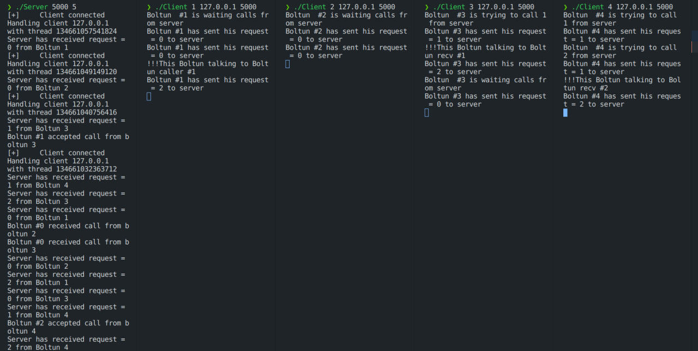
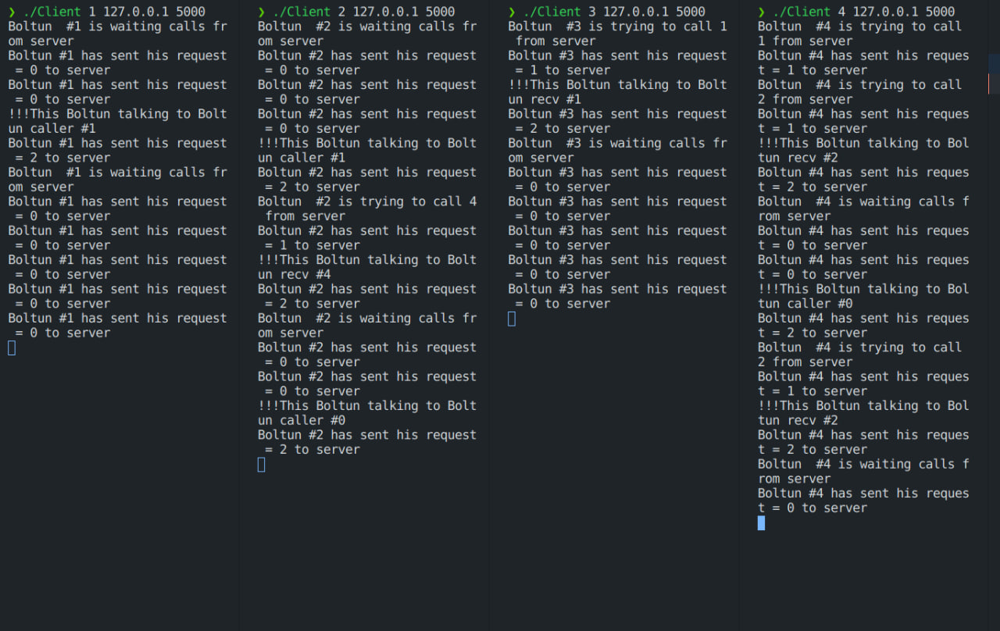

# Мирошниченко Денис Александрович Вариант 23

## TCP/IP. (5 баллов)

### Условие задачи:

Задача о болтунах. N болтунов имеют телефоны. Они либо некоторое (случайное) время ждут звонков, либо звонят друг другу, чтобы побеседовать. Если телефон случайного абонента занят, болтун будет звонить другому случайному абоненту, пока ему кто-нибудь не ответит. Побеседовав некоторое время, болтун или ждет звонка, или звонит на другой случайный номер.

Создать клиент–серверное приложение, моделирующее поведение болтунов.

Каждый болтун — отдельный клиент. Сервер получает число болтунов при запуске и является коммутатором. Для автоматизации процесса запуск клиентов можно осуществлять скриптом. Также можно каждого клиента запускать вручную.

### Пояснение

Для обеспечения корректного взаимодействия сетевых приложений и существующих в них процессов используются неименованные семафоры (имитирующие работу мьютексов): для регулирования доступа к списку задач и для вывода информации о каждой задаче по завершению очередного взаимодействия.
Разработанное приложение позволяет задавать ip-адрес сервера, к которому подключаются клиенты. Запускать сначала сервер - потом клиентов.

Компиляция через эти команды(компилируем вместе с библиотекой):

```sh
gcc TCPLib.c Client.c -o Client
gcc TCPLib.c Server.c -o Server
```

### Запуск сервера (port) (кол-во болтунов не менять - всегда 5):

```sh
./Server 5000 5
```

### Запуск клиентов можно осуществлять вручную. (id) (ip server) (port)

```sh
./Client 1 127.0.0.1 5000
./Client 2 127.0.0.1 5000
./Client 3 127.0.0.1 5000
./Client 4 127.0.0.1 5000
./Client 5 127.0.0.1 5000
```

## Требования

### Cценарий

Сервер разделяется на потоки для каждого из клиентов, при этом храня о них информацию в статической памяти. Изначально программа сделана для 5 болтунов. Общение между клиентами и сервером-коммутатором происходит посредство сигналов. Структура данных Call содержит id (чтобы различать запросы от каждого из болтунов хранящиеся на сервере), caller_id (равен -1 если болтун ждет звонка) и receiver_id - задан айди болтуна если он ожидает звонок или айди того, кому совершается звонок от самого болтуна.

Болтун запускаясь, реашет ожидать ему звонка или звонить самому, он возвращается к этому снова и снова после любого удачного звонка или после того как ему не ответил ни один из болтунов. Обычно выполнение программы зависает на этапе когда все болтуны ждут звонка, так как в условии не было сказано что им делать в такой ситуации - они будут ждать пока кто-нибудь не позвонит.

### Результаты




